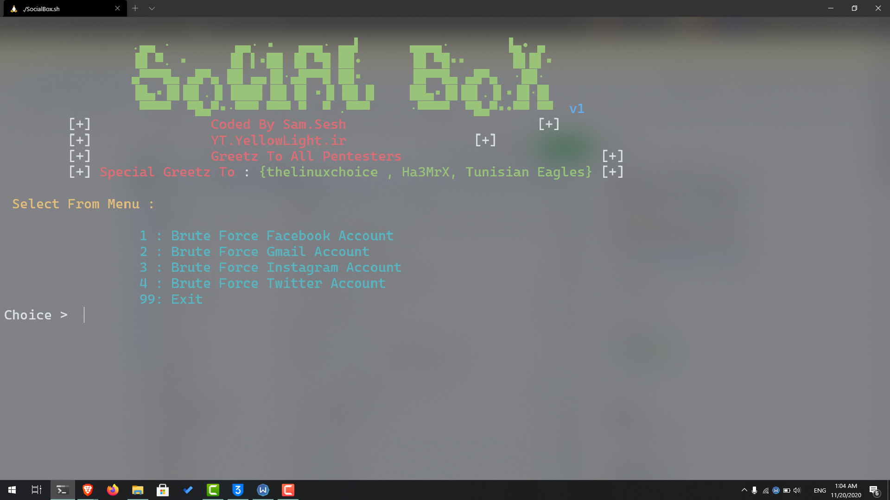

# SocialBox
SocialBox is a Bruteforce Attack Framework [ Facebook , Gmail , Instagram ,Twitter ] , update and edit by init__0
# Installation
```
sudo apt-get install git
git clone https://github.com/samsesh/SocialBox.git
cd SocialBox
chmod +x SocialBox.sh
chmod +x install-sb.sh
./install-sb.sh
./SocialBox.sh
```
### Donate
- If this project very help you to penetration testing  and u want support me , you can give me a cup of coffee :)
- [](bitcoin:BC1QF3NTHFRDKD7QJN4KP6YJDRRFSX5WHU39P9X5CP) : ```BC1QF3NTHFRDKD7QJN4KP6YJDRRFSX5WHU39P9X5CP```

# Screenshots :

# Tested On :
* Backbox linux
* Ubuntu 
* Kali linux
# for termux On android :
* [open](https://github.com/samsesh/SocialBox-Termux)
# Contact
* [Contact](https://twitter.com/init__0) - init__0
# Authors :

* instagram : https://github.com/umeshshinde19/instainsane
* Twitter   : https://github.com/neight-1/-tweetshell-
* SocialBox update : sam sesh
